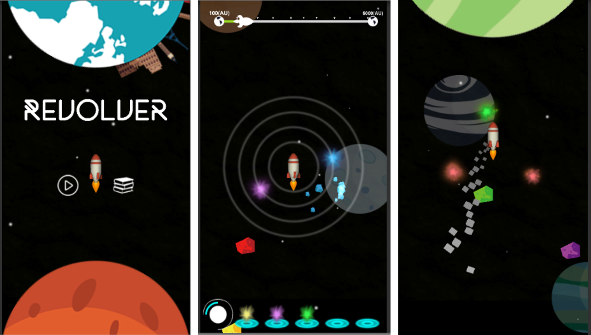

# Revolver
## 2017 Game Design Course Final Project

### Poster

### Introduction
A 2D mobile action game focused on the rotate input of touch screen.
In addition to choose such simple touch gesture as input, we dedicated ourselves to creating a relaxing game experience and make the gameplay easy to all mobile player.

### Gameplay
The pleyer needs to click the light spot and put it on the orbit to protect the center rocket. 
To overcome the danger coming from the all direction, the player need to rotate the orbit and make the spots block the danger away. 

###  Video

